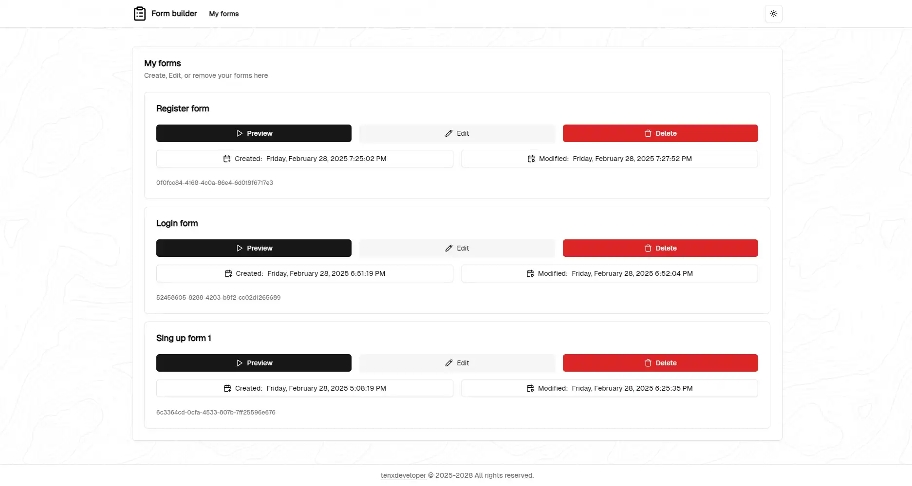

# 📝 Blazor Drag & Drop Form Builder


## 🚀 Overview
A powerful **drag-and-drop form builder** built with **Blazor WASM** and **ASP.NET Core**. This application allows users to create, customize, and preview forms effortlessly.

## ✨ Features
- **Drag & Drop Interface** – Easily add and arrange form elements.
- **Custom Form Fields** – Textboxes, dropdowns, switches, buttons, and more.
- **Persistence** – All changes, new forms, edits are persisted to an SQLite database using EFCore.
- **Real-time Preview** – Instantly see how your form will look.
- **Data Persistence** – Save and load forms dynamically.
- **Dark mode** – A sleek, modern design that's easy on the eyes.
- **Blazing Fast Performance** – Leveraging Blazor WebAssembly for a seamless experience.

## 📸 Preview


## 🛠️ Getting Started
### 🔧 Prerequisites
Ensure you have the following installed:
- [.NET 9 SDK](https://dotnet.microsoft.com/en-us/download/dotnet/9.0)
- [Node.js](https://nodejs.org/en/download)
- [Make](https://www.gnu.org/software/make/manual/make.html)
- [Tailwindcss CLI v3.4](https://github.com/tailwindlabs/tailwindcss/releases/tag/v3.4.17) 
> [!CAUTION]
> Make sure the TailwindCSS CLI version is less than 4!!!

### 📦 Clone the repo
```sh
git clone https://github.com/ddjerqq/BlazorFormBuilder.git
cd BlazorFormBuilder
```

### 🔓 Configure the .env
```sh
echo "/path/to/solution/app.db" > .env
```

> [!WARNING]
> Replace `/path/to/solution/app.db` with the path to your solution.

### 🌐 Run the app
```sh 
dotnet watch run --project src/WebApi/WebApi.csproj
```
> [!NOTE] 
> Building tailwind classes, seeding the database will all get taken care of automatically, 
> you don't have to worry about configurations, as long as you have all the required dependencies 

## 📜 License
This project is licensed under the GNU General purpose license – see the [LICENSE](LICENSE) file for details.

## 📸 More screenshots




